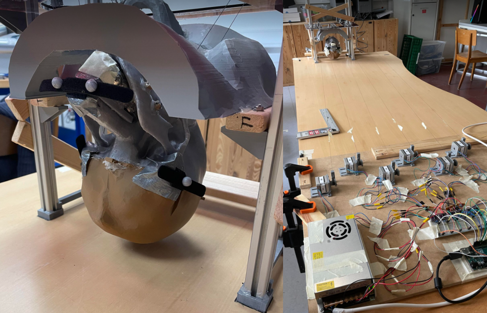

# Simulating Human Movement in MRI: A Soft Phantom Head Approach with Machine Learning Integration
This repository contains all sharable code/data from our master thesis.

By Mads Daugaard \& Emil Riis-Jacobsen.

Faculty of Science University of Copenhagen.

Handed in: May 31. 2024.


[](https://www.youtube.com/watch?v=Sc_tomtOb3E&ab_channel=MadsDaugaard)

# Requirements
## Python
The required python 3.10.13 packages can be found in "environment.yml", and easily be instaled with anaconda using this command:

```
conda env create -f environment.yml --name <new_env_name>
```
## Other software used:
* Blender        - 4.0.2
* Fusion 360     - 2.0.18719 x86_64
* Arduino IDE    - 2.3.2
* MATLAB         - R2023b
* KiCad          - 8.0.1
* Geogebra       - 6.0.838.0
* Ultimaker Cura - 5.6.0


# File overview

## Final code filer
 * serial_and_motor.ino
 * serial_mc_integration_v2.ipynb
 * 6rod_v2_sensor_wmesh.ipynb
 * SOME ML FILES
 * The best trained model

## Data
* testperson data
* starting model data?? do we ned
* every trained model

## Models
* \FinalModels - all meshes used in final product

## Files for creating images for the report
* \MRICode
* \Drawings


## Prototypes
*  \Modeling      \Fusion_models   \Blender
*  \Arduino
*  \Tracking - Various ml files
*  \MatLabCode - For converting voxel map into stl using marching cubes
  
